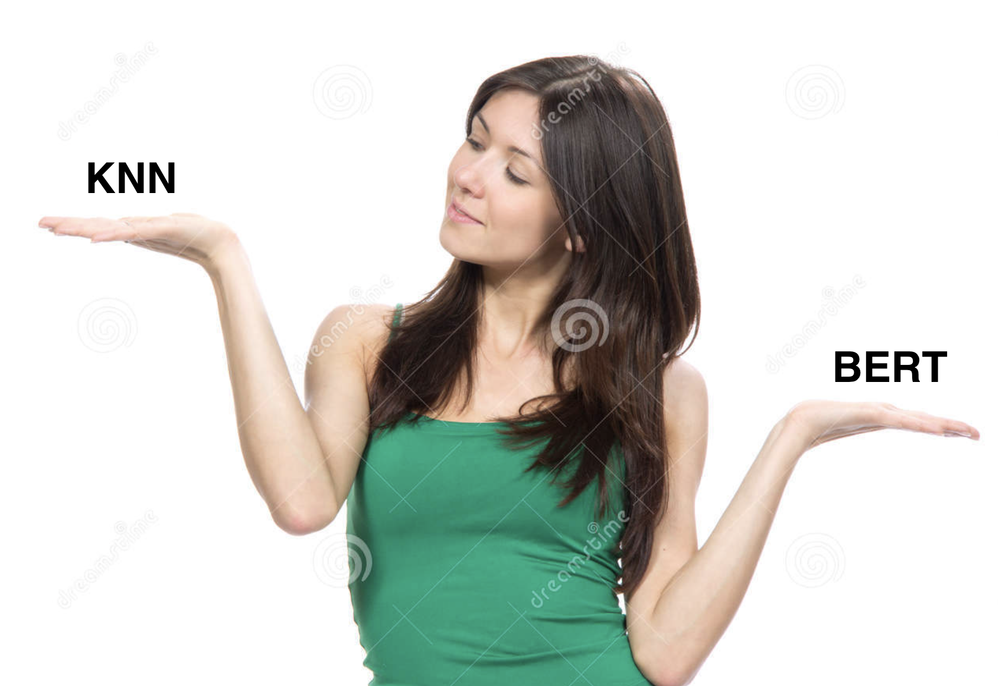

# paraphrases

## Problem
Yandex users set various queries in Search. To evaluate how well we solved the user's problem when he asked for his first query - we compare his query with his subsequent queries.

We want to learn how to distinguish between requests that relate to the solution of one problem. This is the definition of a paraphrase.

Example:
User session: (1. кета диета ->  2. что можно есть во время кета диеты -> 3. безуглеводные продукты список)
Conclusion: All three queries solve the same problem. The user wants to know what the keta-diet is, examples of menus, or available products. These queries are our specific paraphrases.

Your main task is to learn how to get relevant data for this specific problem. After that, you can use the dataset to train the model and use it to create a quality metric (the number of paraphrase user requests in one session).

## What do you need to do?
1. Collect dataset with Toloka
2. Vectorize and cluster data
3. Validate result (you can just see on small sample)

In the following, I will offer several approaches to using machine learning to make this part easier for you.

## What you have?

### Vectorization methods
We will have two approaches to vectorization. Native solution based on Tf-Idf and advanced solution using a pre-trained model.

1. [Tf-Idf](https://scikit-learn.org/stable/modules/generated/sklearn.feature_extraction.text.TfidfVectorizer.html?highlight=tf+idf#sklearn.feature_extraction.text.TfidfVectorizer) + [PCA](https://scikit-learn.org/stable/modules/generated/sklearn.decomposition.PCA.html)
2. [Pre-trained embeddings by DeepPavlov](http://docs.deeppavlov.ai/en/master/features/pretrained_vectors.html) - you can use ELMo or Ru-BERT whatever

### Clusterization
Both algorithms I propose require an initial estimate of the number of clusters. Therefore, you need to implement this function on the training dataset.
1. KMeans
2. Agglomerative

### Datasets
For pretraining model
1. [RUS-ParaFrizer](http://paraphraser.ru/)
2. [ENG-Microsoft Research Paraphrase Corpus](http://paraphraser.ru/)
3. Find another

### Metrics
Please, use this metric to calculate your model score:
1. from sklearn.metrics.cluster import adjusted_rand_score as ARI
2. [purity_score](purity_score.py)

